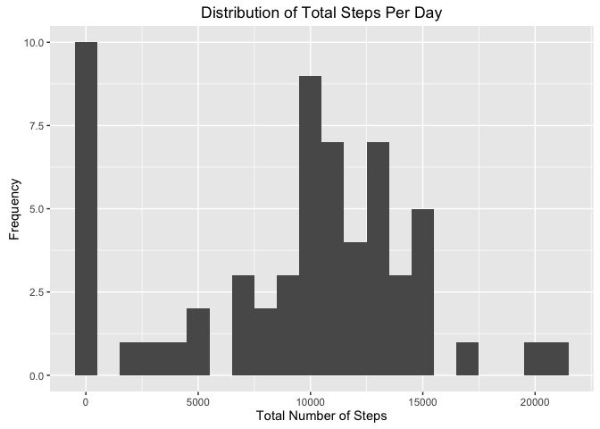
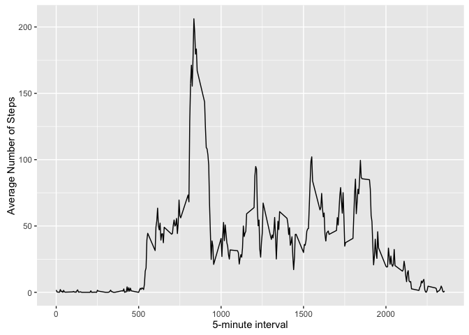
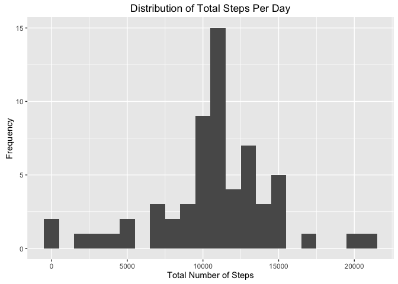
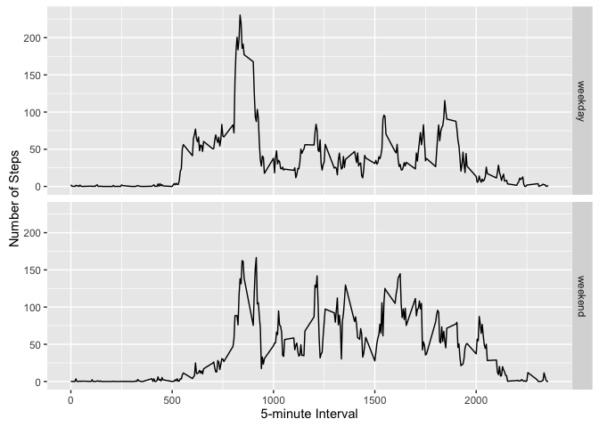

# Reproducible Research: Peer Assessment 1


```r
library(ggplot2)
```

```
## Warning: package 'ggplot2' was built under R version 3.2.4
```

## Loading and preprocessing the data

First, we'll download the data and unzip in our working directory


```r
fileURL <- "https://d396qusza40orc.cloudfront.net/repdata%2Fdata%2Factivity.zip"
fileName <- "activity.zip"

#download the file:
download.file(fileURL, destfile = fileName, method = "curl")

#unzip the file:
unzip(fileName)
```

Next, we'll read the data into R and prep it for analysis

```r
#read the csv
activity_data <- read.csv("activity.csv", na.strings = "NA")

#convert date to date class
activity_data$date <- as.Date(activity_data$date, "%Y-%m-%d")
```


## What is mean total number of steps taken per day?
Here we're taking a look at the distribution of total number of steps per day. Note that missing values (NA's) are being removed.


```r
#use tapply to calculate the total per day
total_steps <- tapply(activity_data$steps, activity_data$date, sum,  na.rm = TRUE)

#plot histogram showing the distribution of total steps per day
qplot(total_steps, binwidth=1000, xlab="Total Number of Steps", ylab = "Frequency", main = "Distribution of Total Steps Per Day")
```



Next, let's look at the mean & median of the total steps per day.


```r
#calculate the mean
mean(total_steps, na.rm = TRUE)
```

```
## [1] 9354.23
```
The mean is 9,354.


```r
#calculate the median
median(total_steps, na.rm = TRUE)
```

```
## [1] 10395
```
The median is 10,395.


## What is the average daily activity pattern?

First, we'll take a look at the average number of steps per 5-minute interval


```r
# calculate the average number of steps by interval
interval_avg_steps <- aggregate(x = list(steps = activity_data$steps), by = list(interval =  activity_data$interval), FUN = mean, na.rm = TRUE)

# plot the data
ggplot(data = interval_avg_steps, aes(x = interval, y = steps)) + geom_line() + xlab("5-minute interval") + ylab("Average Number of Steps")
```



Next, we find the interval which has the highest average of steps

```r
interval_avg_steps[which.max(interval_avg_steps$steps), ]
```

```
##     interval    steps
## 104      835 206.1698
```
Interval 835 has the highest average, with 206 steps


## Imputing missing values

First, let's find how many records are missing values

```r
sum(is.na(activity_data$steps))
```

```
## [1] 2304
```
The number of records with NA for steps is:  2304.

Now, let's replace the NAs with the average for the respective 5-minute interval (which was previously calculated into the interval_avg_steps object).


```r
# replace each missing value with the mean value of the respective 5-minute interval
# create a function that will determine if the value is NA and pulls in the interval average if necessary
fill_value <- function(steps, interval) {
    filled <- NA
    if (!is.na(steps)) 
        filled <- c(steps) else filled <- (interval_avg_steps[interval_avg_steps$interval == interval, "steps"])
    return(filled)
}

# copy the activity data to a new data frame
activity_data_filled <- activity_data

# fill in the missing values (if needed) in the new data frame using mapply to call the newly created fill_value function
activity_data_filled$steps <- mapply(fill_value, activity_data_filled$steps, activity_data_filled$interval)
```

Now let's see what impact filling in the missing values has by plotting another histogram of total steps per day.


```r
#use tapply to calculate the total per day
total_steps_filled <- tapply(activity_data_filled$steps, activity_data_filled$date, sum,  na.rm = TRUE)

#plot histogram showing the distribution of total steps per day
qplot(total_steps_filled, binwidth=1000, xlab="Total Number of Steps", ylab = "Frequency", main = "Distribution of Total Steps Per Day")
```



Next, let's look at the mean & median of the total steps per day again, this time using the filled in data.


```r
#calculate the mean
mean(total_steps_filled, na.rm = TRUE)
```

```
## [1] 10766.19
```
The mean is now 10766.


```r
#calculate the median
median(total_steps_filled, na.rm = TRUE)
```

```
## [1] 10766.19
```
The median is now 10,766.

The mean and median values are higher after imputing the missing values.


## Are there differences in activity patterns between weekdays and weekends?

We need to determine if the date was for a weekday or weekend. We'll use the weekdays() function to help us.  We'll call it from within our own function.

```r
#create a fuction to determine the type of day (weekday or weekend day).  this fuction will call the weekdays() function
day_type <- function(date) {
    day <- weekdays(date)
    if (day %in% c("Monday", "Tuesday", "Wednesday", "Thursday", "Friday")) 
        return("weekday") else if (day %in% c("Saturday", "Sunday")) 
        return("weekend") else stop("invalid date")
}

activity_data_filled$day_type <- sapply(activity_data_filled$date, FUN=day_type)
```

Now let's plot the data to see if there's a difference between activity on weekdays versus weekends

```r
#calculate the average by interval and day_type
interval_avg_steps_by_day_type <- aggregate(steps ~ interval + day_type, data = activity_data_filled, mean)
ggplot(interval_avg_steps_by_day_type, aes(interval, steps)) + geom_line() + facet_grid(day_type ~ .) + 
    xlab("5-minute Interval") + ylab("Number of Steps")
```


